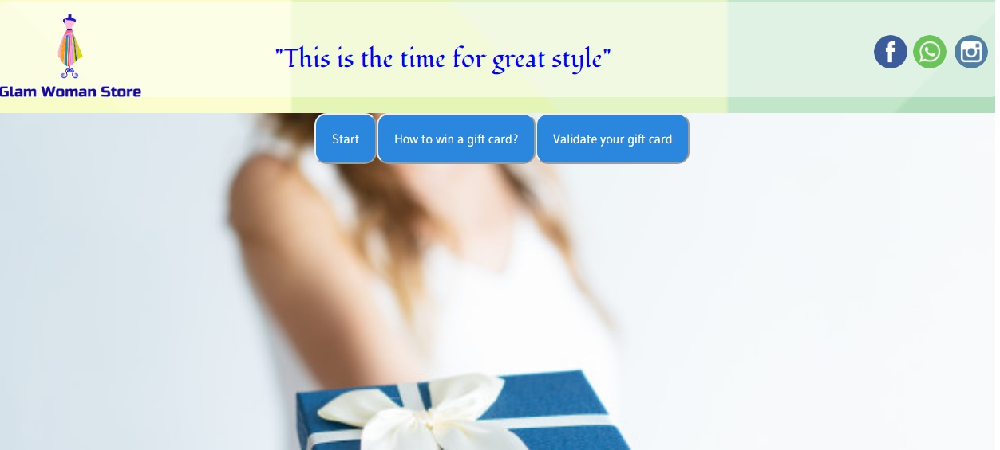
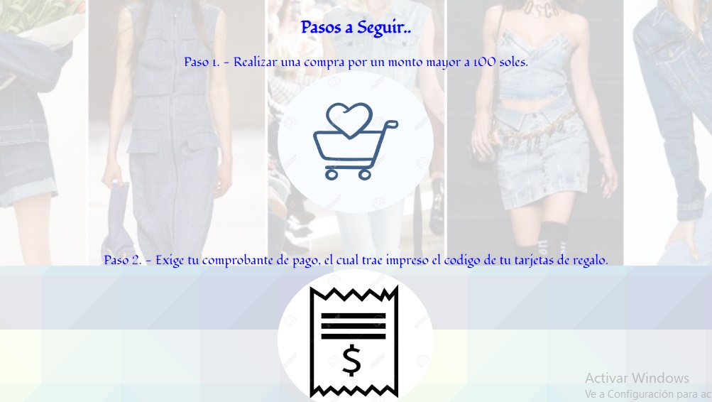
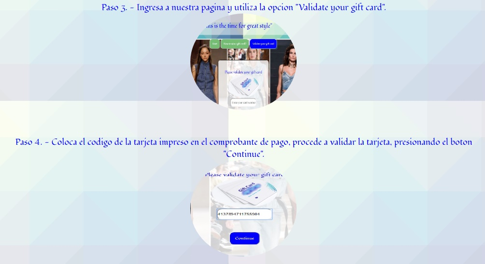
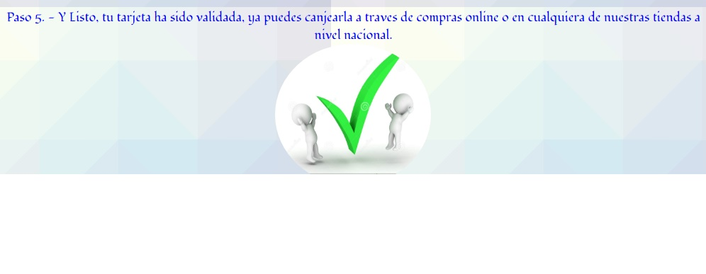
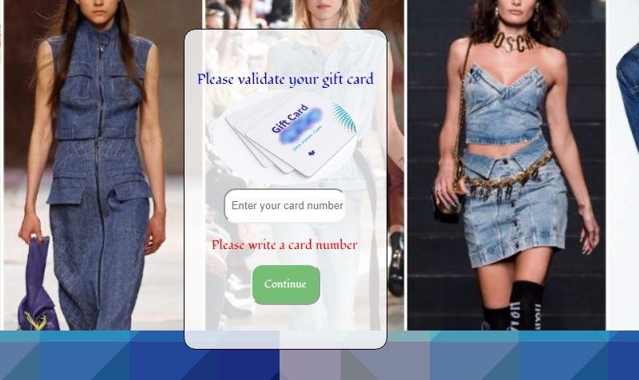
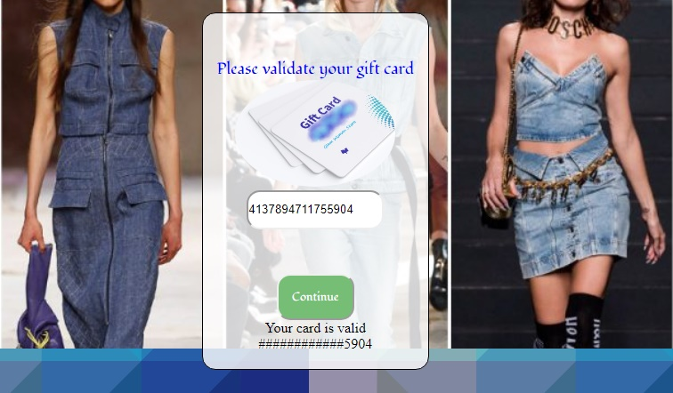
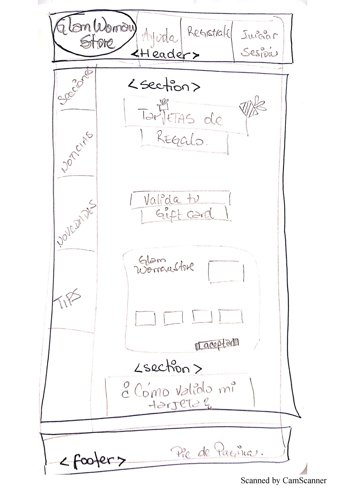
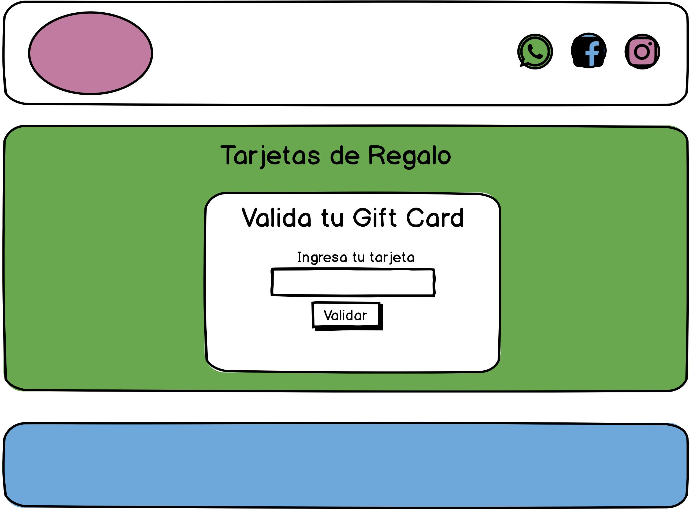

# Gift Cards- Glam Woman Store

Se trata de una aplicación web, que te permite validar la tarjeta de regalo obsequiada en la red de tiendas de la cadena Glam Woman Store. Esta útil app le permite al usuario verificar la validez de su tarjeta de regalo.

# Instrucciones y Funcionalidad.

Esta pagina cuenta con dos secciones principales, las cuales les detallo a continuación:

Sección 1
# How to win a gift card? o Como ganar una tarjeta de regalo?

Al presionar este boton, se despligan una serie de instrucciones, la cuales constan de 5 pasos, descritos de maneja sencilla y ambientadas con un icono por cada paso, se ven de la siguiente forma:

# Validate your gift card o Valida tu tarjeta de regalo.

En esta sección el cliente podrá escribir los números de la tarjeta de regalo que desea validar y le mostrara si tiene validez o no. En el caso de que el usuario presione el boton de "Continue" sin digitar número le aparecera un texto de alerta indicando que debe digitar un número de su tarjeta.

La página tambien cuenta con un footer o encabezado en el cual, figuran los íconos de las redes sociales : Instagram, whatsapp y facebook, la cuales redireccionan a las diferentes redes sociales.

## * Investigación UX:
  1. Explicar quiénes son los usuarios y los objetivos en relación con el
    producto.

  * Usuarios: Son los clientes de la cadena de Tiendas Glam Woman Store, quienes reciben una gift card por la cantidad de 50 soles, por cada compra mayor a 100 soles.

  * Objetivo: Que los usuarios beneficiados con la tarjeta, puedan verificar la validez de su gift card, lo cual contribuirá con la satisfacción y fidelización en general del cliente.

  2. Explicar cómo el producto soluciona los problemas/necesidades de dichos
    usuarios.

  * Este producto está pensado en la necesidad de los usuarios que han sido beneficiados con una tarjeta de regalo de la cadena de tienda Glam Woman Store, quienes desearán comprobar la validez de su tarjeta, desearán activarla y consultar su saldo, lo cual podrán realizar a través de esta app.

  3. Primer prototipo en papel.

  

  Primer prototipo en Balsamiq.

   

  4. Agregar un resumen del feedback recibido indicando las mejoras a realizar.

  A lo largo de los dos spring se recibieron los siguientes feedbacks por parte de compañeras y familiares:

  ** La pagina inicialmente contenia mucho color azul.

  ** No poseía guía de instrucciones.

  ** Los íconos de redes sociales, sólo eran adorno, no redireccionaban.

  5. Imagen del prototipo final.

  

  ## .. Objetivos de aprendizaje
El objetivo principal de aprendizaje es adquirir experiencia desarrollando
aplicaciones web (WebApp) que interactúen con el usuario a través del navegador
y la lógica, utilizando HTML, CSS y JavaScript como herramientas.
Reflexiona y luego marca los objetivos que has llegado a **entender** y
**aplicar** en tu proyecto.

### UX
* [ ] [Diseñar la aplicación pensando y entendiendo al usuario](https://lms.laboratoria.la/cohorts/lim-2020-01-bc-core-lim012/courses/intro-ux/01-el-proceso-de-diseno/00-el-proceso-de-diseno)
* [ ] [Crear prototipos para obtener feedback e iterar](https://lms.laboratoria.la/cohorts/lim-2020-01-bc-core-lim012/courses/product-design/00-sketching/00-sketching)
* [ ] [Aplicar los principios de diseño visual](https://lms.laboratoria.la/cohorts/lim-2020-01-bc-core-lim012/courses/product-design/01-visual-design/01-visual-design-basics)

### HTML y CSS
* [ ] [Uso correcto de HTML semántico](https://developer.mozilla.org/en-US/docs/Glossary/Semantics#Semantics_in_HTML)
* [ ] [Uso de selectores de CSS](https://developer.mozilla.org/es/docs/Web/CSS/Selectores_CSS)
* [ ] [Construir tu aplicación respetando el diseño realizado](https://lms.laboratoria.la/cohorts/lim-2020-01-bc-core-lim012/courses/css/01-css/02-boxmodel-and-display) (maquetación).

### DOM
* [ ] [Uso de selectores de nodos del DOM](https://lms.laboratoria.la/cohorts/lim-2020-01-bc-core-lim012/courses/browser/02-dom/03-1-dom-methods-selection)
* [ ] [Manejo de eventos del DOM](https://lms.laboratoria.la/cohorts/lim-2020-01-bc-core-lim012/courses/browser/02-dom/04-events)
* [ ] [Manipulación dinámica del DOM](https://developer.mozilla.org/es/docs/Referencia_DOM_de_Gecko/Introducci%C3%B3n)

### Javascript
* [ ] [Manipulación de strings](https://lms.laboratoria.la/cohorts/lim-2020-01-bc-core-lim012/courses/javascript/06-strings/01-strings)
* [ ] [Uso de condicionales](https://lms.laboratoria.la/cohorts/lim-2020-01-bc-core-lim012/courses/javascript/02-flow-control/01-conditionals-and-loops)
* [ ] [Uso de bucles](https://lms.laboratoria.la/cohorts/lim-2020-01-bc-core-lim012/courses/javascript/02-flow-control/02-loops)
* [ ] [Uso de funciones](https://lms.laboratoria.la/cohorts/lim-2019-09-bc-core-lim011/courses/javascript/02-flow-control/03-functions)
* [ ] [Datos atómicos y estructurados](https://www.todojs.com/tipos-datos-javascript-es6/)
* [ ] Utilizar ES Modules (`import` | `export`).

### Testing
* [ ] [Testeo de tus funciones](https://jestjs.io/docs/es-ES/getting-started)

### Git y GitHub

* [ ] [Comandos de git](https://lms.laboratoria.la/cohorts/lim-2019-09-bc-core-lim011/courses/scm/01-git/04-commands)
  (`add` | `commit` | `pull` | `status` | `push`).
* [ ] [Manejo de repositorios de GitHub](https://lms.laboratoria.la/cohorts/lim-2019-09-bc-core-lim011/courses/scm/02-github/01-github)  (`clone` | `fork` | `gh-pages`).

### Buenas prácticas de desarrollo
* [ ] Organizar y dividir el código en módulos (Modularización).
* [ ] Uso de identificadores descriptivos (Nomenclatura | Semántica).
* [ ] Uso de linter para seguir buenas prácticas (ESLINT).

